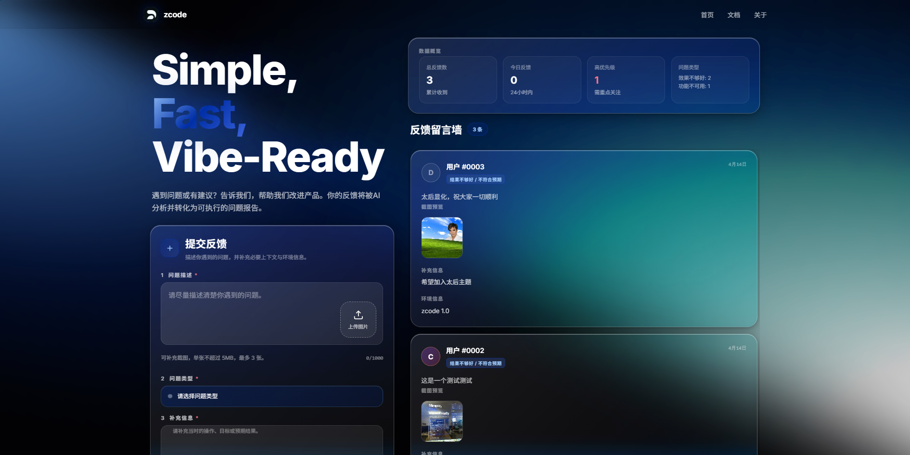

# Auto Feedback | 反馈收集问卷系统

[](https://nodejs.org/)
[](https://vuejs.org/)
[](https://www.mysql.com/)
[](https://docs.docker.com/compose/)

> 一款面向产品体验优化的 **匿名反馈收集与 AI 结构化分析系统**，支持问题反馈提交、截图上传、AI 自动归因、反馈看板、管理追踪页与飞书日报推送。
>
> 用户反馈会写入 MySQL 原始数据表，并异步调用 **DashScope Qwen VL** 生成可检索、可统计、可追踪的结构化分析结果。

适用于产品团队、研发团队和运营团队集中收集用户问题，快速识别高频故障、体验阻塞、AI 质量问题和功能缺口。项目支持本地开发运行，也支持通过 Docker Compose 一键部署到服务器。

---

## 界面预览

<p align="center">
  
</p>

<p align="center">
  <a href="http://47.95.113.32">Website</a> ·
  <a href="http://47.95.113.32/api/admin/feedbacks/view">Admin</a> ·
</p>
---

## 目录

- [亮点速览](#亮点速览)
- [快速开始](#快速开始)
- [Docker 部署](#docker-部署)
- [安全提示](#安全提示)
- [相关文档](#相关文档)


## 亮点速览

- **匿名提交**：用户无需登录即可提交问题类型、问题描述、上下文、环境信息、联系方式和截图。
- **截图辅助分析**：支持 JPG/JPEG/PNG，默认最多 3 张，单张最大 5 MB。
- **AI 自动归因**：输出根因、功能模块、用户意图、流程阶段、严重程度、置信度和判断依据。
- **反馈看板**：前端实时展示统计摘要、反馈列表和截图预览。
- **飞书日报**：默认每天 09:00 按 Asia/Beijing 时区推送前一日反馈概览，执行时间通过 `.env` 配置。

---

## 快速开始

### 1. 安装依赖

```bash
cd backend
npm install

cd ../frontend
npm install
```

### 2. 配置环境变量

复制环境变量模板：

```bash
cp .env.example .env
```

至少需要修改：

```env
MYSQL_ROOT_PASSWORD=change_me_to_a_strong_password
DB_PASSWORD=change_me_to_a_strong_password
DASHSCOPE_API_KEY=your_dashscope_api_key
FEISHU_WEBHOOK_URL=your_feishu_bot_webhook_url
REPORT_PUBLIC_BASE_URL=http://your-domain-or-server-ip
DAILY_REPORT_CRON=0 9 * * *
DAILY_REPORT_TIMEZONE=Asia/Shanghai
```

本地开发时，如果 MySQL 运行在宿主机：

```env
DB_HOST=localhost
UPLOAD_DIR=./uploads
```

Docker Compose 部署时：

```env
DB_HOST=mysql
UPLOAD_DIR=/app/uploads
NODE_ENV=production
```

### 3. 初始化数据库

Docker Compose 首次启动会自动执行 `infra/mysql/init.sql`。如果使用本地 MySQL，需要手动导入：

```bash
mysql -uroot -p < infra/mysql/init.sql
```

初始化脚本会创建：

- `raw_data.feedbacks`：保存用户原始反馈。
- `processed_data.ai_analysis`：保存 AI 结构化分析结果。

### 4. 启动开发服务

后端：

```bash
cd backend
npm run dev
```

前端：

```bash
cd frontend
npm run dev -- --host 0.0.0.0 --port 5173
```

默认访问地址：

- 前端：`http://47.95.113.32`
- 后端健康检查：`http://47.95.113.32/api/admin/feedbacks/view`

## Docker 部署

完整部署流程见 [DEPLOYMENT.md](./DEPLOYMENT.md)。

最小启动流程：

```bash
cp .env.example .env
# 编辑 .env 后再启动
docker compose build
docker compose up -d
docker compose ps
```

默认端口：

- 前端 Nginx：`80`
- 后端 API：`3000`
- MySQL：仅在 Docker 内部网络暴露

## 安全提示

- 不要提交 `.env`、真实 API Key、数据库密码或飞书 Webhook。
- 当前管理页面和手动日报接口没有鉴权，公网开放前应增加登录、IP 白名单或反向代理鉴权。
- 生产环境建议只公开前端 `80/443`，不要直接公开后端 `3000`。
- 上传目录应使用持久化存储，并制定定期清理或归档策略。
- 如果密钥曾经泄露，应及时轮换 `DASHSCOPE_API_KEY`、`DB_PASSWORD` 和飞书 Webhook。

## 相关文档

- [部署说明](./DEPLOYMENT.md)
- [API 文档](./docs/API.md)
- [环境变量说明](./docs/ENVIRONMENT.md)
- [排障手册](./DEBUGGING_PLAYBOOK.md)
- [产品需求文档](./PRD.md)
